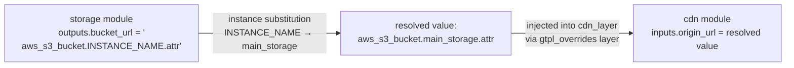

# Cross-Resource Reference Guide

## Overview

When one infrastructure resource depends on an attribute of another (for example, a CDN needs the
URL of an S3 bucket it will front), the IaC provider requires a provider-specific reference
expression: Terraform uses `resource_type.resource_name.attribute`, Bicep uses
`resourceSymbol.properties.propertyPath`, and CloudFormation uses `!GetAtt LogicalId.Attribute`.

graydr's output reference mechanism handles the instance-name substitution automatically while
preserving the provider-native expression verbatim in the compiled output. The module author
writes the expression once; the template author wires it using a standard `${resource.output}`
reference that works the same way regardless of provider.

---

## How It Works

The cross-resource wiring involves three pieces that interact at compile time:

**Step 1 — Module declares outputs in its interface:**

```hcl
interface {
  outputs {
    bucket_url = {}
  }
}
```

**Step 2 — Module provides the provider-native expression in the case arm:**

```hcl
generate {
  case "provider" {
    aws {
      code = <<-EOT
        resource "aws_s3_bucket" "$bucket_name" { ... }
      EOT
      outputs {
        bucket_url = "${aws_s3_bucket.INSTANCE_NAME.bucket_regional_domain_name}"
      }
    }
  }
}
```

`INSTANCE_NAME` is a placeholder. At compile time, graydr replaces it with the resource instance
name declared in the `.gtpl` file (e.g., `main_storage`), yielding:

```
aws_s3_bucket.main_storage.bucket_regional_domain_name
```

**Step 3 — Template wires the output to another resource's input:**

```hcl
resource "main_storage" {
  module = "storage"
  inputs { bucket_name = "$infra.name" }
}

resource "cdn_layer" {
  module = "cdn"
  inputs { origin_url = "${main_storage.bucket_url}" }
}
```

The `${main_storage.bucket_url}` reference fetches the resolved output value from the
`main_storage` resource instance and injects it into `cdn_layer`'s render context.

**Step 4 — Compiled output uses the provider-native expression verbatim:**

The CDN module's code block receives `origin_url` as a resolved variable containing the full
Terraform/Bicep/CloudFormation expression string. That string is emitted to the compiled output
as-is.

### Data Flow Diagram



---

## Terraform HCL Output Patterns

Terraform cross-resource references use the format `resource_type.resource_name.attribute`.

### Module: storage (aws arm)

```hcl
module "storage" {
  ...
  interface {
    outputs { bucket_url = {} }
  }

  generate {
    case "provider" {
      aws {
        code = <<-EOT
          resource "aws_s3_bucket" "$bucket_name" {
            bucket = "$bucket_name"
          }
        EOT
        outputs {
          bucket_url = "${aws_s3_bucket.INSTANCE_NAME.bucket_regional_domain_name}"
        }
      }
    }
  }
}
```

### Module: cdn (aws arm)

```hcl
module "cdn" {
  ...
  interface {
    inputs {
      origin_url = { required = true }
    }
  }

  generate {
    case "provider" {
      aws {
        code = <<-EOT
          resource "aws_cloudfront_distribution" "cdn" {
            origin {
              domain_name = "$origin_url"
            }
          }
        EOT
        outputs {}
      }
    }
  }
}
```

### Template wiring them together

```hcl
template "cdn-platform" {
  ...
  resource "main_storage" {
    module = "storage"
    inputs { bucket_name = "$infra.name" }
  }

  resource "cdn_layer" {
    module = "cdn"
    inputs { origin_url = "${main_storage.bucket_url}" }
  }
}
```

At compile time, the `storage` module's `INSTANCE_NAME` placeholder is replaced with
`main_storage`, so the `cdn_layer` module receives:

```
origin_url = "aws_s3_bucket.main_storage.bucket_regional_domain_name"
```

The compiled Terraform output for the CDN resource then contains:

```hcl
resource "aws_cloudfront_distribution" "cdn" {
  origin {
    domain_name = aws_s3_bucket.main_storage.bucket_regional_domain_name
  }
}
```

See `tests/fixtures/docs/cross-resource-terraform.gtpl` for a complete runnable example.

---

## Bicep Output Patterns

Bicep references use the format `resourceSymbolicName.properties.propertyPath`.

### Module: storage (azure arm)

```hcl
module "storage" {
  ...
  generate {
    case "provider" {
      azure {
        code = <<-EOT
          resource storageAccount 'Microsoft.Storage/storageAccounts@2021-09-01' = {
            name: '$bucket_name'
            location: '$region'
          }
        EOT
        outputs {
          bucket_url = "storageAccount.properties.primaryEndpoints.blob"
        }
      }
    }
  }
}
```

**Important note:** In Bicep output expressions, the value is the Bicep expression string
itself — no `${}` wrapping. This string passes through to the compiled output verbatim.
The resource symbolic name in the output expression (`storageAccount`) must match the
symbolic name used in the code block's Bicep resource declaration.

### Module: cdn (azure arm)

```hcl
module "cdn" {
  ...
  generate {
    case "provider" {
      azure {
        code = <<-EOT
          var cdnOrigin = '$origin_url'
        EOT
        outputs {}
      }
    }
  }
}
```

### What the consuming module receives

After instance substitution and output injection, the `cdn_layer` module receives:

```
origin_url = "storageAccount.properties.primaryEndpoints.blob"
```

The property path after `.properties.` is defined in the module, not derived from the instance
name. The instance name substitution affects only the resource symbolic name prefix when the
module author includes `INSTANCE_NAME` in the expression.

See `tests/fixtures/docs/cross-resource-bicep.gtpl` for a complete runnable example.

---

## CloudFormation Output Patterns

CloudFormation uses logical IDs and `!GetAtt` / `!Sub` for cross-resource references.
CloudFormation logical IDs use PascalCase by convention, unlike Terraform's `resource_type.name` format.

### Module: storage (aws arm with CloudFormation output)

```hcl
module "storage" {
  ...
  generate {
    case "provider" {
      aws {
        code = <<-EOT
          Resources:
            MainStorageBucket:
              Type: AWS::S3::Bucket
              Properties:
                BucketName: "$bucket_name"
        EOT
        outputs {
          bucket_url = "!GetAtt MainStorageBucket.WebsiteURL"
        }
      }
    }
  }
}
```

### Module: cdn (aws arm consuming the output)

```hcl
module "cdn" {
  ...
  generate {
    case "provider" {
      aws {
        code = <<-EOT
          Resources:
            CdnDistribution:
              Type: AWS::CloudFront::Distribution
              Properties:
                DistributionConfig:
                  Origins:
                    - DomainName: "$origin_url"
        EOT
        outputs {}
      }
    }
  }
}
```

After injection, the CDN module receives:

```
origin_url = "!GetAtt MainStorageBucket.WebsiteURL"
```

**CloudFormation caveat:** graydr does not validate CloudFormation YAML syntax. Body text in
heredoc code blocks passes through to the compiled output untouched. CloudFormation's own
`${LogicalId.Attribute}` syntax (used inside `!Sub` strings) is **not** interpreted by graydr
as a variable reference because graydr's variable scanner distinguishes between `$identifier`
(graydr variable) and `${...}` (IaC-native interpolation — passed through unchanged).

---

## Common Patterns Reference Table

| Provider         | Output expression form                                    | Example                                                     |
|------------------|-----------------------------------------------------------|-------------------------------------------------------------|
| Terraform HCL    | `${resource_type.INSTANCE_NAME.attribute}`                | `${aws_s3_bucket.main_storage.bucket_regional_domain_name}` |
| Bicep            | `resourceSymbol.properties.propertyPath`                  | `storageAccount.properties.primaryEndpoints.blob`           |
| CloudFormation   | `!GetAtt LogicalId.Attribute`                             | `!GetAtt MainStorageBucket.WebsiteURL`                      |

---

## Troubleshooting

**1. Using `$variable_name` inside an output template string when you mean an IaC expression**

```hcl
# Wrong — graydr interprets $bucket as a variable to substitute
outputs { bucket_url = "$bucket.endpoint" }

# Right — IaC-native expression (not interpreted by graydr)
outputs { bucket_url = "${aws_s3_bucket.INSTANCE_NAME.bucket_regional_domain_name}" }
```

**2. Hardcoding the resource instance name instead of using `INSTANCE_NAME`**

```hcl
# Wrong — locks the module to only work when the resource is named "my_storage"
outputs { bucket_url = "${aws_s3_bucket.my_storage.bucket_regional_domain_name}" }

# Right — INSTANCE_NAME is substituted automatically at compile time
outputs { bucket_url = "${aws_s3_bucket.INSTANCE_NAME.bucket_regional_domain_name}" }
```

**3. CloudFormation logical IDs must be PascalCase**

The graydr resource instance name (declared in `.gtpl`) may be `snake_case`. If you include
the instance name in a CloudFormation output expression, adjust the casing in the module:

```hcl
# If the resource instance is "main_storage", the CF logical ID might be "MainStorageBucket"
# These are not the same — adjust the module's output expression accordingly
outputs { bucket_url = "!GetAtt MainStorageBucket.WebsiteURL" }
```

**4. `UnresolvedVariable` error on a consuming module's input**

Ensure the producer resource is declared in the template *before* the consumer. graydr
processes resources in declaration order; referencing `${producer.output}` before the
producer resource is declared returns an `UnresolvedVariable` error.
