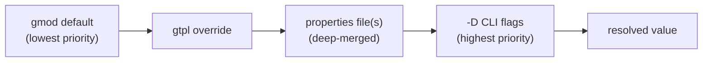

# graydr v2 Language Specification

## 1. Overview

graydr is a compile-time text preprocessor for Infrastructure-as-Code files. It takes `.gmod` module definitions, `.gtpl` template orchestration files, and optional `.gfrag` code fragments, resolves variables from a four-source priority chain, dispatches to the correct provider arm via case statements, assembles the result, and writes the final IaC source file (Terraform HCL, Bicep, CloudFormation YAML, or any other text format). graydr has no runtime, no provider SDK, and no abstraction layer — it emits real provider code that is then fed directly to your IaC toolchain. The compiled output has no dependency on graydr; it is ordinary Terraform/Bicep/CloudFormation that you can read, audit, and version like any handwritten file.

---

## 2. File Types

### 2.1 `.gmod` — Module File

A module is the unit of provider-specific logic. It declares:
- What inputs it accepts (the interface)
- What outputs it exposes
- Validation rules
- One or more case dispatch blocks that emit IaC code for each provider arm

Use a module when you have a reusable infrastructure component (a storage bucket, a database, a network) that needs different IaC code per provider or per configuration axis.

### 2.2 `.gtpl` — Template File

A template orchestrates one or more modules into a deployable stack. It declares:
- Parameter groups that group related variables
- Resource instances (each wired to a module)
- Cross-resource output references
- Template-level output declarations

Use a template when you need to compose multiple modules and wire their inputs and outputs together.

### 2.3 `.gfrag` — Fragment File

A fragment is a reusable snippet of raw IaC code that can be included into a case arm's `code` block via the `include` directive. It has no interface block, no validation, and no dispatch — it is raw text with optional graydr `$variable` references.

Use a fragment for boilerplate that repeats across multiple modules (tag blocks, common IAM policies, shared locals).

---

## 3. Grammar

The following grammar uses EBNF notation. Productions are derived directly from `src/ast/module.rs`, `src/ast/template.rs`, and `src/ast/fragment.rs`.

```ebnf
(* Top-level file types *)
graydr_file     ::= module_file | template_file | fragment_file

(* ─── Module file ─── *)
module_file     ::= "module" STRING_LABEL "{" module_body "}"
module_body     ::= metadata_block interface_block validation_block generate_block

metadata_block  ::= "metadata" "{" metadata_attr* "}"
metadata_attr   ::= ("description" | "version") "=" STRING
                  | ("security_tier" | "compliance_frameworks"
                    | "cost_tier" | "data_classification"
                    | "disaster_recovery_tier") "=" STRING
                  | "approval_required" "=" BOOL

interface_block ::= "interface" "{" inputs_block outputs_block "}"
inputs_block    ::= "inputs" "{" input_decl* "}"
input_decl      ::= IDENTIFIER "=" "{" input_attr* "}"
input_attr      ::= "required" "=" BOOL
                  | "sensitive" "=" BOOL
                  | "default" "=" literal

outputs_block   ::= "outputs" "{" output_decl* "}"
output_decl     ::= IDENTIFIER "=" "{" "}"

validation_block ::= "validation" "{" rule_decl* "}"
rule_decl        ::= "rule" STRING_LABEL "{" rule_attr* "}"
rule_attr        ::= "condition"     "=" STRING
                   | "error_message" "=" STRING
                   | "severity"      "=" severity_val
severity_val     ::= '"error"' | '"warning"' | '"info"'

generate_block  ::= "generate" "{" case_block+ "}"

(* case_block dispatches on one or more variable names *)
case_block      ::= "case" STRING_LABEL+ "{" case_arm+ "}"

(* Single-variable arm: bare IDENTIFIER is the key *)
(* Multi-variable arm: "arm" keyword followed by one STRING_LABEL per variable *)
case_arm        ::= IDENTIFIER "{" "code" "=" heredoc case_arm_outputs? "}"
                  | "arm" STRING_LABEL+ "{" "code" "=" heredoc case_arm_outputs? "}"
case_arm_outputs ::= "outputs" "{" output_mapping* "}"
output_mapping  ::= IDENTIFIER "=" STRING

(* ─── Template file ─── *)
template_file   ::= "template" STRING_LABEL "{" template_body "}"
template_body   ::= metadata_block parameters_block resource_instance* outputs_section

parameters_block  ::= "parameters" "{" parameter_group* "}"
parameter_group   ::= IDENTIFIER "{" param_decl* "}"
param_decl        ::= IDENTIFIER "=" "{" "}"

resource_instance ::= "resource" STRING_LABEL "{" resource_attr* "}"
resource_attr     ::= "module" "=" STRING
                    | "inputs" "{" input_binding* "}"
                    | "depends_on" "=" "[" STRING_LABEL* "]"
input_binding     ::= IDENTIFIER "=" STRING

outputs_section   ::= "outputs" "{" output_mapping* "}"

(* ─── Fragment file ─── *)
fragment_file   ::= "fragment" STRING_LABEL "{" "code" "=" heredoc "}"

(* ─── Lexical rules ─── *)
STRING_LABEL    ::= '"' [^"]* '"'        (* quoted string — used as block label *)
IDENTIFIER      ::= [a-zA-Z_][a-zA-Z0-9_-]*  (* unquoted identifier *)
STRING          ::= '"' [^"]* '"'        (* HCL quoted string, may contain $var references *)
BOOL            ::= "true" | "false"
heredoc         ::= "<<-EOT" NEWLINE raw_text NEWLINE "EOT"
literal         ::= STRING | BOOL | heredoc
```

### 3.1 Case Arm Syntax — Critical Note

> In the single-variable `case "variable_name" {}` form, each arm is a bare identifier: `aws { ... }`. In the multi-variable form (`case "provider" "engine" { ... }`), each arm uses the `arm` keyword followed by one string label per variable: `arm "aws" "aurora" { ... }`. The arm identifier form is a backward-compatible degenerate case of the label form. The parenthesized form `case ($var) {}` is **invalid HCL** — `hcl-edit` block labels accept only `StringLit | Identifier`. Do not use parentheses.

---

## 4. Types and Literals

graydr uses HCL as its surface syntax. The following literal types appear in graydr files:

| Type      | Syntax                          | Example                          |
|-----------|---------------------------------|----------------------------------|
| String    | `"double-quoted"`               | `"us-east-1"`                   |
| Boolean   | `true` or `false`               | `required = true`               |
| Heredoc   | `<<-EOT` ... `EOT`              | Multi-line IaC code block        |

String values may embed:
- graydr variable references: `$variable_name` or `$group.field` — substituted at compile time
- IaC-native interpolation: `${expr}` — passed through untouched to the output file

The distinction is critical: `$bucket_name` is replaced by graydr during compilation; `${var.region}` is Terraform syntax that graydr leaves unchanged.

---

## 5. Variable References

graydr variables use the `$` sigil followed by an identifier:

```
$variable_name          # simple variable
$group.field            # dotted path — resolves group.field from a nested properties map
```

**Dotted paths** resolve nested keys from properties files. If a properties YAML file contains:
```yaml
primary_db:
  region: us-east-1
```
then `$primary_db.region` resolves to `us-east-1` at compile time.

**IaC-native interpolation** uses the `${...}` form and is **never** processed by graydr:
```
${var.region}               # Terraform-native — passed through
${aws_s3_bucket.name.id}    # Terraform resource reference — passed through
```

graydr's variable scanner identifies `$identifier` patterns and explicitly excludes any `$` immediately followed by `{`, so `${...}` expressions in heredoc code blocks are preserved verbatim in the output.

---

## 6. Variable Resolution Chain

Variables are resolved from four sources in priority order (lowest to highest):

```
Priority (lowest → highest):
1. gmod default      — default = "value" in interface.inputs declaration
2. gtpl override     — inputs { key = "literal" } in resource block
3. properties files  — YAML or JSON files; deep-merged in declaration order
4. -D flags          — -D key=value on the CLI; repeatable; last value for a given key wins
```



**Missing = fail.** Any variable reference that cannot be resolved from these four sources is a **hard compile error** (`UnresolvedVariable`). There is no fallback, no null, no empty string. The variable name and source position are reported:

```
example.gmod:14:7: unresolved variable '$db_engine'
```

This is a deliberate v2 design choice: silent fallbacks were the primary source of production misconfigurations in v1.

### 6.1 Properties File Format

Properties files may be YAML or JSON. YAML:
```yaml
primary_db:
  size: XL
  region: us-east-1
provider: aws
```

JSON:
```json
{
  "primary_db": { "size": "XL", "region": "us-east-1" },
  "provider": "aws"
}
```

Nested keys are flattened to dotted paths before resolution: `primary_db.size = "XL"`.

Multiple `--properties` files are deep-merged in declaration order — later files win on key conflicts.

### 6.2 Region Mapping

The `region_mapping.*` namespace in properties files is a special translation table (not a regular variable). Keys with the `region_mapping.` prefix are extracted into a separate mapping table by `ResolveContext::extract_region_mapping()`:

```yaml
region_mapping:
  EAST: us-east-1
  EU: eu-west-1
```

The logical region `EAST` translates to `us-east-1` at compile time. This table is kept separate from the variable resolution context.

---

## 7. Case Statement

The `case` statement dispatches to one arm based on the resolved value of one or more variables. The selected arm's `code` block is rendered into the output.

```hcl
generate {
  case "provider" {
    aws {
      code = <<-EOT
        # AWS-specific Terraform here
      EOT
    }
    azure {
      code = <<-EOT
        # Azure-specific Bicep here
      EOT
    }
  }
}
```

**Dispatch semantics:**
1. The variable names in `case STRING_LABEL+ {}` are resolved via the variable resolution chain.
2. The resolved value(s) are matched against the arm keys.
3. The first arm whose key(s) exactly match the resolved value(s) is selected.
4. If no arm matches, a hard compile error (`NoMatchingArm`) is raised.

**No fallback / no default arm.** Every case must have a matching arm for the resolved variable value, or compilation fails.

### 7.1 Multi-Variable Dispatch

When dispatching on multiple variables simultaneously, use the multi-variable form:

```hcl
case "provider" "engine" {
  arm "aws" "aurora" {
    code = <<-EOT
      # AWS with Aurora engine
    EOT
  }
  arm "azure" "sqlserver" {
    code = <<-EOT
      # Azure with SQL Server engine
    EOT
  }
}
```

**HCL structure:** The arm identifier is the literal keyword `arm` and the variable values are HCL block labels. This is required because HCL block labels accept only `StringLit | Identifier` — the `arm "aws" "aurora"` form is an identifier (`arm`) followed by two string labels (`"aws"`, `"aurora"`), which is valid HCL. Expressions like `"aws" = { ... }` (attribute form) are invalid inside HCL block bodies; the identifier keyword `arm` is required.

**Single-variable backward compatibility:** In the single-variable form, the arm identifier is the matching value directly (`aws { }`, `azure { }`). This is the degenerate case where the arm keyword is the value itself, which is valid HCL identifier syntax. The parser treats empty labels as the single-element case: `keys = [ident]`.

---

## 8. Output References

Modules declare output names in their `outputs {}` block within each case arm:

```hcl
aws {
  code = <<-EOT
    resource "aws_s3_bucket" "$bucket_name" { ... }
  EOT
  outputs {
    bucket_url = "${aws_s3_bucket.storage.bucket_regional_domain_name}"
  }
}
```

The output value is an IaC-native interpolation expression (e.g., a Terraform resource attribute reference). graydr passes it through untouched; the IaC toolchain resolves it at plan/apply time.

### 8.1 Cross-Resource Wiring in Templates

When a template wires two resource instances, the consuming resource references the producing resource's output using the `${resource_name.output_name}` syntax in the template's `inputs {}` block:

```hcl
resource "app_storage" {
  module = "storage"
  inputs {
    bucket_name = "$app.name"
    region      = "$primary.region"
  }
}

resource "app_database" {
  module = "database"
  inputs {
    db_name        = "$app.name"
    dependency_ref = "${app_storage.bucket_url}"   # output reference
  }
}
```

The `${app_storage.bucket_url}` reference is resolved by graydr at the gtpl override layer: the output value from `app_storage`'s selected arm is injected into `app_database`'s variable resolution context before rendering. Resources must be declared in dependency order (consumer after producer), or the compiler raises `ForwardOutputReference` (resolved by the dependency graph topo sort in Phase 4).

---

## 9. Governance Metadata

The `metadata {}` block in both `.gmod` and `.gtpl` files supports the following governance fields in addition to `description` and `version`:

| Field                   | Type    | Description                                          |
|-------------------------|---------|------------------------------------------------------|
| `security_tier`         | string  | Security classification (e.g., `"high"`, `"low"`)  |
| `compliance_frameworks` | string  | Comma-separated list (e.g., `"SOC2,PCI-DSS"`)       |
| `cost_tier`             | string  | Cost classification (e.g., `"premium"`, `"standard"`) |
| `data_classification`   | string  | Data sensitivity (e.g., `"confidential"`, `"public"`) |
| `disaster_recovery_tier` | string | DR classification (e.g., `"tier1"`, `"tier3"`)      |
| `approval_required`     | boolean | Whether deployment requires manual approval          |

Governance fields are carried to the compiled output as a comment block prepended to the generated IaC:

```
# graydr governance metadata
# security_tier: high
# compliance_frameworks: SOC2,PCI-DSS
# cost_tier: premium
# data_classification: confidential
# disaster_recovery_tier: tier1
# approval_required: true
```

In community tier, these fields are informational only — graydr does not enforce approval gates or compliance checks at compile time.

---

## 10. Module Fragments

Fragments allow reusable IaC snippets to be included into a case arm's `code` block.

### 10.1 Include Directive

```
include "path/to/snippet.gfrag"
include "subfolder/tags.gfrag"
```

The path is relative to the include search directories specified by `--include-path` on the CLI. Fragment code is inlined at the include site before variable substitution occurs, so `$variable` references inside the fragment resolve using the same context as the enclosing arm.

### 10.2 Deferred Registry Form

```
include "org/name@1.2.0"
```

Registry coordinate includes (containing `/` and `@`) are parsed but **not resolved** in community tier. The compiler emits a warning and leaves the include as a comment in the output. This form is reserved for the enterprise registry implementation.

### 10.3 Cycle Detection

Fragment includes support transitive includes. Circular include chains (A includes B includes A) are a hard compile error (`FragmentError::CycleDetected`). Cycle detection uses an active call stack (not a visited set), so diamond dependencies (two paths to the same fragment) are permitted — the fragment is included once per include site.

### 10.4 Source Maps

When a compilation error occurs inside an included fragment, graydr reports the error at the fragment file and line, not at the `include` site. A source map tracks byte ranges in the expanded content back to their origin file and line offset.

---

## 11. Error Reference

All graydr errors exit with code 1. Error messages include the file and position in `file:line:col` format.

### 11.1 Parse Errors (`src/parser/error.rs`)

| Error Name             | Trigger Condition                                                      | Example Message Format                                              |
|------------------------|------------------------------------------------------------------------|---------------------------------------------------------------------|
| `HclParse`             | The file is not valid HCL                                              | `HCL parse error in storage.gmod: unexpected token at line 5`      |
| `MissingRequiredBlock` | A required block (`metadata`, `interface`, `validation`, `generate`) is absent | `storage.gmod:1:1: missing required block 'interface' in module`    |
| `UnknownBlock`         | An unrecognized block name appears where a known block is expected     | `storage.gmod:12:3: unknown block 'config'`                         |
| `InvalidCaseLabel`     | A `case` block label is not a quoted string variable name              | `storage.gmod:20:5: case block label must be a quoted string variable name` |
| `UnexpectedBlockType`  | The top-level block type is not `module`, `template`, or `fragment`    | `storage.gmod:1:1: expected block type 'module', 'template', or 'fragment', found 'provider'` |
| `MissingLabel`         | A block requiring a quoted string label has none                       | `storage.gmod:8:3: block 'rule' requires a quoted string label`     |

### 11.2 Resolve Errors (`src/resolver/error.rs`)

| Error Name              | Trigger Condition                                                        | Example Message Format                                                    |
|-------------------------|--------------------------------------------------------------------------|---------------------------------------------------------------------------|
| `UnresolvedVariable`    | A `$variable` reference cannot be resolved from any source               | `storage.gmod:14:7: unresolved variable '$db_engine'`                    |
| `MissingRequiredInput`  | A required module input is not wired in the template                     | `web.gtpl:22:5: required input 'bucket_name' of module 'storage' is not wired in template` |
| `UnknownInput`          | A template wires an input name that the module does not declare          | `web.gtpl:23:5: module 'storage' has no input named 'tier'`              |
| `ValidationFailed`      | A validation rule's condition evaluates to false                         | `storage.gmod:18:5: validation rule 'password_not_empty' failed: db_password must not be empty` |
| `InvalidCondition`      | A validation rule condition is not a valid expression                    | `storage.gmod:18:5: invalid condition expression in rule 'check': unexpected token` |
| `PropertiesLoadError`   | A properties file cannot be read or parsed                               | `failed to load properties file 'prod.yaml': invalid YAML at line 3`     |
| `NoMatchingArm`         | No case arm matches the resolved variable value(s)                       | `storage.gmod:25:3: no matching arm for case on ["provider"] = ["gcp"]; tried arms: [["aws"], ["azure"]]` |
| `CircularDependency`    | A cycle is detected in the resource dependency graph                     | `web.gtpl:10:3: circular dependency detected; cycle members: ["storage", "database", "storage"]` |
| `UnknownDependency`     | A `depends_on` entry references a resource name that does not exist      | `web.gtpl:15:5: resource 'database' has unknown dependency 'cache' in depends_on` |

---

*Language specification for graydr v2. Derived from source: `src/ast/`, `src/parser/`, `src/resolver/`. Last updated: 2026-03-07.*
